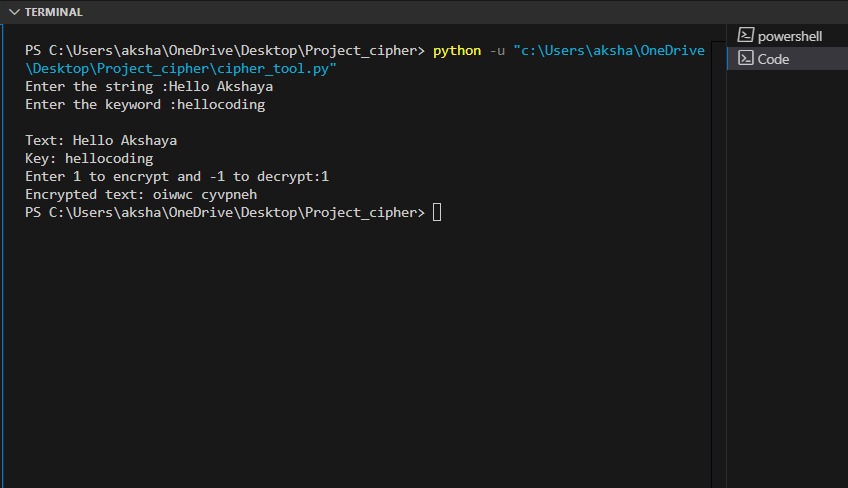

# Vigenere Cipher Using Python  

This is an implementation of a simple Vigenere cipher using python. This project is a part of freeCodecamp course ***ScientificComputing Using Python***.

## Project folders

`cipher_tool.py`: Python code file.  
`sampleoutput`: Contains the sample output.

## Features  

- Easily switch between encyption and decryption.  
- Customizable keyword.  
- Handles spaces, uppercase, lowercase and non-alphabetic symbols.

### How it works

The encryption process involves shifting each letter of the plaintext using an offset determined by the corresponding letter in the keyword. If a character isn't part of the alphabet, it is simply carried over unchanged.

### Example

